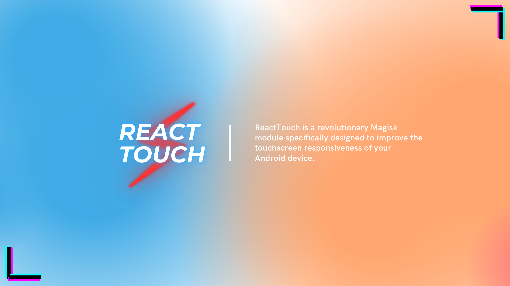

# ReactTouch

ReactTouch is a revolutionary Magisk module specifically designed to improve the touchscreen responsiveness of your Android device.

:calling: Universal for all device

## Installation

- Magisk V22+

## Changelog :

### v1.2
- added tweaks touch
  - echo '1'  > /sys/module/msm_performance/parameters/touchboost
  - echo '1' > /sys/power/pnpmgr/touch_boost
- Change system.prop
  - MultitouchSettleInterval 0.1ms
  - TapInterval 0.1ms
  - touch.distance.calibration area
  - touch.orientation.calibration=interpolated
  - touch.size.calibration=geometric
  - windowsmgr.max_events_per_sec=120
  - ro.max.fling_velocity=12000
  - ro.min.fling_velocity=8000
- added new prop
  - ro.min_pointer_dur 8
  - touch.toolSize.areaScale=22
  - touch.toolSize.isSummed=0
  - TapDragInterval=0.1ms
  - persist.vendor.qti.inputopts.enable=true
  - persist.vendor.qti.inputopts.movetouchslop=0.1
  - persist.dev.pm.dyn_samplingrate=1
  - persist.pm.on_fire=1
  - QuietInterval=0.1ms
  - SurfaceOrientation=0

### v1.1
- Change TapSlop 1px1 For High Responsive
- Change touch.pressure.calibration physical to amplitude 
- Added touch.deviceType touchScreen
- Added Other Tweaks :
  - pm.dexopt.bg-dexopt=speed-profile: Optimizes the dexopt process for applications with a speed profile to improve the speed of code optimization.
  - pm.dexopt.shared=speed: Optimizes the dexopt process for applications using shared libraries with a focus on speed.
  - profiler.launch=false: Disables launch profiling of applications to avoid performance impact during app launch.
  - profiler.force_disable_err_rpt=1: Forces the disabling of error reporting for application profiling.
  - profiler.force_disable_ulog=1: Forces the disabling of ulog usage for application profiling.
  - profiler.debugmonitor=false: Disables the debug monitor for application profiling.
  - profiler.hung.dumpdobugreport=false: Disables debug report dumping for application profiling in case of failure.
  - MIN_HIDDEN_APPS=false: No short explanation is given, possibly used in specific system configurations.
  - MIN_RECENT_TASKS=false: No short explanation is given, possibly used in specific system configurations.
  - APP_SWITCH_DELAY_TIME=false: No short explanation is given, possibly used in specific system configurations.
  - vidc.debug.level=0: Sets the debug level for the video component (vidc) to level 0 (no debug).
  - vidc.debug.perf.mode=2: Sets the performance mode for the video component (vidc) to mode 2.
  - ro.floatingtouch.available=1: Indicates the availability of the floating touch feature on the device with a value of 1 (available).
  - windowsmgr.max_events_per_sec=300: This setting determines the maximum number of touch events per second that the window manager can process. By setting it to 300, the window manager can handle up to 300 touch events in a single second, providing a smoother and more responsive touch experience.
  - ro.max.fling_velocity=13800: This configuration sets the maximum fling velocity, which is the speed at which a scroll or swipe gesture reaches its maximum distance. By setting it to 13800, the maximum fling velocity is limited to 13800 pixels per second. This prevents excessively fast scrolling or swiping actions and ensures better control and user experience.
  - ro.min.fling_velocity=10500: This configuration sets the minimum fling velocity, which is the speed at which a scroll or swipe gesture starts moving. By setting it to 10500, the minimum fling velocity is set to 10500 pixels per second. This ensures that small fling gestures are recognized and do not require excessive effort from the user to initiate scrolling or swiping.

### v1.0
- Initial Release
